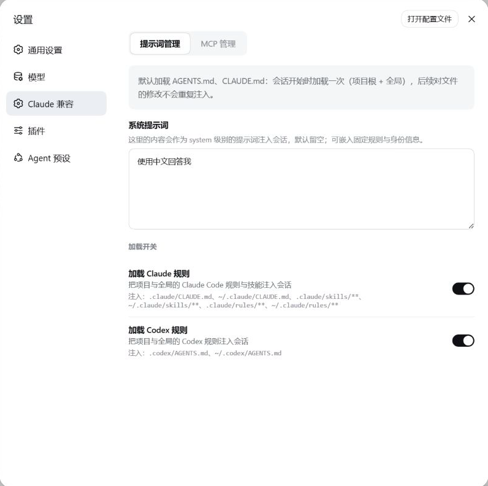

# dsh-claude-compat

[English](README.md) | 中文

一个**独立**的 [DeepSeek Harness](https://github.com/deepseek-ai/deepseek-harness)（DSH）插件：让 harness 复用你已有的
**Claude Code / Codex** 配置，并在 Web 设置页里开关规则注入与编辑系统提示词，不用再手改 YAML。

它不打包 `@deepseek-ai/*`，这些包在运行时从宿主 harness 解析。

## 截图

### 提示词管理 —— 系统提示词与规则开关

一个 system 级别的提示词输入框，加上 Claude 规则与 Codex 规则注入的总开关。



## 这个插件有什么用

MCP 服务器管理（增删改、按需加载、工具过滤）是**另一个独立插件**
[`@zhang-guo-wen/dsh-mcp-manager`](https://github.com/zhang-guo-wen/dsh-mcp-manager)；这个包只管 Claude Code /
Codex 兼容与 `/btw`。两个包互不依赖，设置页里各自是一个区块。

- **Claude Code 兼容。** 发现 `<root>/.claude/skills/**` 进会话技能目录；把 `.claude/CLAUDE.md` 与
  `~/.claude/CLAUDE.md` 折进首个请求；折入 `.claude/rules/**`，其中带 `paths:` 的规则会在你读取匹配文件后生效。
- **Codex 兼容。** 折入 `.codex/AGENTS.md` 与 `~/.codex/AGENTS.md`。
- **`/btw`。** 从当前会话分叉出的新会话里问一个侧边问题。分叉锚定在最后一个已完成的回合，所以回合进行中
  提问会从上一个已结束的回合分叉，新会话把父会话的已完成回合当作自己的历史。答案显示在输入框内的卡片里；
  答案落地后卡片自动收起，并归档那个分叉会话。

## 安装

构建好的 `lib/` 随仓库提交，所以装完即可运行，**你这边不需要构建**。

```sh
# HTTPS
npx @deepseek-ai/dsh plugin --profile web add git+https://github.com/zhang-guo-wen/dsh-claude-compat.git

# 或 SSH
npx @deepseek-ai/dsh plugin --profile web add git+ssh://git@github.com/zhang-guo-wen/dsh-claude-compat.git
```

建议锁定发布 tag，这样默认分支上后续的临时提交不会被人拿到：

```sh
npx @deepseek-ai/dsh plugin --profile web add "git+ssh://git@github.com/zhang-guo-wen/dsh-claude-compat.git#v0.1.3-alpha.1"
```

要对着本地 checkout 开发，就装目录。pnpm 会建**软链**，所以重建 `lib/` 后下次启动即生效，无需重装：

```sh
npx @deepseek-ai/dsh plugin --profile web add /绝对路径/dsh-claude-compat
```

然后重启 host 并打开设置页：

```sh
npx @deepseek-ai/dsh web
```

**不要手写 profile 清单**：`dsh plugin add` 会同时加依赖条目与 bundle 条目。
卸载用 `dsh plugin --profile web remove @zhang-guo-wen/dsh-claude-compat`，依赖与层一起移除。

## 配置

每个字段都有可用的默认值，下表用于覆盖其中某一项。标注了"设置页"的字段可以直接在界面上改。

| 字段 | 默认 | 含义 |
|---|---|---|
| `providerName` | `claude-code` | 注册到 `ctx.skills` 的提供器唯一名 |
| `claudeHome` | `$CLAUDE_HOME` 或 `~/.claude` | Claude Code 主目录，扫描 `skills` 与 `CLAUDE.md` |
| `codexHome` | `$CODEX_HOME` 或 `~/.codex` | Codex 主目录，扫描 `AGENTS.md` |
| `projectRootMarkers` | `['.git']` | 用来识别项目根的目录项 |
| `includeProjectRoot` / `includeGlobalRoot` | `true` | 扫描项目 / 用户的 `.claude/skills` 根 |
| `includeProjectRule` / `includeGlobalRule` | `true` | 加载项目 / 全局的 `CLAUDE.md` 规则 |
| `includeProjectRules` / `includeGlobalRules` | `true` | 折入项目 / 用户的 `.claude/rules/**` 树 |
| `maxRuleSourceBytes` | `1048576` | 单个规则文件最多读取的 UTF-8 字节 |
| `maxRuleRenderBytes` | `262144` | 单批规则最多渲染的 UTF-8 字节 |
| `claude` / `codex` | `true` | 规则注入总开关（设置页） |
| `maxQuestionBytes` | `4096` | `/btw` 侧边问题的最大 UTF-8 字节 |

```yaml
- name: '@zhang-guo-wen/dsh-claude-compat'
  config:
    claude: true
    codex: true
```

## 已知限制

- **没有技能监听器** —— `.claude/skills` 在列出目录时被发现；新增、改名、删除要等下一次发现。
- **规则每会话只折入一次** —— `.claude/CLAUDE.md`、`~/.claude/CLAUDE.md`、`.codex/AGENTS.md` 在首个请求时读取，
  会话中途的改动不会被重读。
- **带路径的规则只在 `read` 时触发** —— `write` / `edit` 不会激活它们。

## 开发

构建方式、Cordis/Typert 插件契约与各种坑见 [AGENTS.md](AGENTS.md)。

```sh
npm run build      # host（tsdown）+ client（rolldown ModuleLoader handoff）
npm run typecheck
```

## 许可

Apache License 2.0 —— 见 [LICENSE](LICENSE)。本项目包含源自 DeepSeek Harness 的 MIT 许可部分，见 [NOTICE](NOTICE)。
与 Claude Code、Codex 及其所有者无隶属或背书关系。
