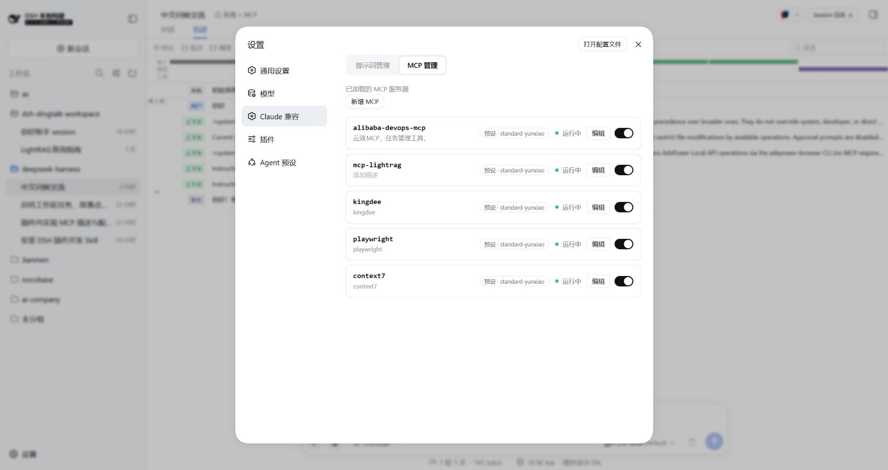

# dsh-claude-compat

[English](README.md) | 中文

一个**独立于 harness monorepo** 的 DeepSeek Harness (DSH) 插件:让 Harness 直接复用你现有的
Claude Code / Codex 配置,并在设置页加一个 **Harness 兼容** 面板 —— **在网页里管理 MCP 服务器
和提示词规则,不用再手改 YAML**。



## 有什么用

- **MCP 管理(实时)**:设置页列出所有 MCP 服务器(每个 `@deepseek-ai/dsh-mcp-client` 行)——
  全局的、以及每个 agent 预设里的,带作用域、描述、运行状态;每行可 **编辑 / 启用 / 禁用**,顶部可
  **新增**。写回组合文件后**立即对运行中的 host 生效,无需重启**。开关时那一行会短暂显示
  `启动中 / 停止中`,列表不会卡住。
- **Claude Code 兼容**:把 `<root>/.claude/skills/**` 纳入会话技能目录;把 `.claude/CLAUDE.md` 与
  `~/.claude/CLAUDE.md` 折叠进首次请求;折叠 `.claude/rules/**` —— 带 `paths:` 作用域的规则在你
  读到匹配文件时激活。
- **Codex 兼容**:折叠 `.codex/AGENTS.md` 与 `~/.codex/AGENTS.md`。
- **系统提示词**:在设置页写一段 system 级提示词,作为真实 system 提示词段注入。
- **两个总开关**:分别控制 Claude 规则 / Codex 规则的注入。
- **`/btw`**:在 fork 出的可继续子代理里问一个旁支问题。

## 截图

### 提示词管理 —— 系统提示词与规则开关


### MCP 管理 —— 一个 JSON 框,保存时解析并校验


## 安装

构建产物 `lib/` **已提交进仓库**,所以直接从 git 安装就能用,无需构建。

### 从 git 仓库安装(推荐)

装**发布 tag**(如 `v0.1.3-alpha.1`),而不是默认分支 —— 这样你之后往 `master` 推的**临时提交不会被人拿到**:

```sh
# HTTPS(公开仓库)
npx @deepseek-ai/dsh plugin --profile web add "git+https://github.com/zhang-guo-wen/dsh-claude-compat.git#v0.1.3-alpha.1"

# 或 SSH
npx @deepseek-ai/dsh plugin --profile web add "git+ssh://git@github.com/zhang-guo-wen/dsh-claude-compat.git#v0.1.3-alpha.1"
```

`#<ref>` 锁定 **tag / commit / 分支**;仓库根**就是**插件包,所以不需要 `path:` 参数。
去掉 `#<ref>` 就会跟随默认分支(不推荐);换新 tag 重跑即可升级。

### 从本地 checkout 安装

```sh
npx @deepseek-ai/dsh plugin --profile web add /绝对路径/dsh-claude-compat
```

目录安装走的是 pnpm 的 `link:`,profile 的 `node_modules` 里是**软链**指向 checkout,
所以重建后的 `lib/` 下次启动即生效,无需重装。

### 在 profile 清单里声明

这个清单**不用手写**——`dsh plugin add` 会同时维护两个列表。此处仅说明结果:

```json
{
  "dsh": { "profile": { "bundles": ["@zhang-guo-wen/dsh-claude-compat"] } },
  "dependencies": {
    "@zhang-guo-wen/dsh-claude-compat": "link:/绝对路径/dsh-claude-compat"
  }
}
```

装好后运行 `npx @deepseek-ai/dsh web`,打开设置页即可。

## 管理 MCP 服务器

打开 **设置 → Harness兼容 → MCP 管理**。harness 里配置过的每一台 MCP 都会列出,带作用域
(`全局` 或预设 id)、插件自带描述、以及实时状态。每行有 **编辑** 按钮和启用/禁用开关,
**新增 MCP** 打开编辑框。

这个列表是**每次调用都实时读 Cordis Loader**,所以改动一旦应用就会立刻反映:

- **全局** 行直接走 loader,实时生效。
- **预设(agent)** 行写预设的 `agent.cordis.yml`,再**就地刷新**该预设的 standing mount ——
  所以启用/禁用一台**不会**重启其它 MCP。

### 编辑框的 JSON

编辑框接受 Claude 兼容的连接 JSON 并归一化。以下写法都可以:

```json
{ "type": "stdio", "command": "cmd", "args": ["/c", "npx", "-y", "@upstash/context7-mcp"] }
```

```json
{ "context7": { "command": "cmd", "args": ["/c", "npx", "-y", "@upstash/context7-mcp"] } }
```

```json
{ "mcpServers": { "context7": { "command": "cmd", "args": ["/c", "npx", "-y", "@upstash/context7-mcp"] } } }
```

规则:

- 省略 `type` 会推断:有 `command` → stdio,有 `url` → streamable HTTP。
- 单键映射或 `mcpServers` 包装 → 用 key 当服务器名。
- 裸 spec → **服务器名** 字段留空时,从参数推断服务器名(`@upstash/context7-mcp` → `context7-mcp`)。
- stdio 需要 `command`;http / sse / streamable-http 需要 `url`。

**配置范围** 下拉列出「全局 + 所有 agent 预设」,选就行,不用手填 id。**描述** 是插件自带的标签
(存在 `context-injection` settings 命名空间里),**不属于** MCP 连接配置。

### 延迟加载 —— 需要时才启动

每台在跑的 MCP 服务器,它的工具 schema 都会跟着**每一次请求**发出去;十几台的部署就是一直为全部付费。
两件事配合起来就能避免:

1. **让服务器保持停止**:在 MCP 管理里把它的行**禁用** —— 禁用的行不会被挂载,工具也就不进目录。
2. **按需启动**:插件注册了三个工具,模型可以调用:

   | 工具 | 作用 |
   |---|---|
   | `mcp_list` | 列出已配置的服务器、作用域、以及各自是否在运行 |
   | `mcp_load(server)` | **只为当前会话**启动某台服务器,并返回它新增的工具名 |
   | `mcp_unload(server)` | 停掉当前会话的这台服务器,收缩工具列表 |

挂载是 **agent 作用域**的:某个会话加载的服务器,不会出现在别的会话里。这和 Claude Code 的 tool search
是同一类取舍 —— 只在真正需要时付一次往返和多出来的 schema。

### 选择加载方式

两个开关分工不同:

- **每行的启用/禁用开关** = 这台服务器**允不允许用**。禁用 = 完全不用:不出现在 `mcp_list` 里,`mcp_load` 也会拒绝。
- **设置 → Claude 兼容 → MCP 管理 → MCP 加载方式** = 允许的服务器**什么时候进上下文**。三选一:

| 模式 | 行为 |
|---|---|
| 全部加载(`eager`) | 允许的服务器在会话开始时就挂载,工具始终在请求里 |
| 动态插入(`dynamic`,默认) | 允许的服务器**默认不挂载**;需要时 `mcp_load` 把它挂进**当前会话**,它的工具进入请求 —— 工具绑定最好,但每次加载会**变一次工具列表** |
| 延迟加载(`lazy`) | 允许的服务器**默认不挂载**;`mcp_load` 用 **MCP SDK 直连、完全不注册工具**,把工具 schema 作为结果返回,模型用固定的 `mcp_call` 代理调用 —— **工具列表永不变 → 请求缓存前缀零失效** |

实测:同一个 `标准+MCP` 预设(alibaba-devops / lightrag / kingdee / playwright 四台),
`dynamic` 下首次请求的工具数是 **29**(内置工具 + `mcp_list`/`mcp_load`/`mcp_unload`),
`eager` 下是 **378**(其中 348 个是 MCP 工具)。

抑制挂载是**运行时状态**:插件只在内存里摘掉这些行,**不改写你的 preset 文件**
(`agent-presets` 的 preset 树本身就不写回文件),所以切模式不会污染配置;
代价是切换模式会让这几台 MCP 子进程重起一次。

```yaml
- name: '@zhang-guo-wen/dsh-claude-compat'
  config:
    mcpLoading: lazy   # 仅在该用户文档还没有这一项时生效
```

选择保存在用户设置的 `context-injection` 命名空间(`~/.dsh/settings.yaml` 里的 `mcpLoading`),**提交后立即换掉工具集**,
从所有会话的下一次请求起生效;用户还没在 UI 上选过时,才用插件配置行的 `config.mcpLoading` 当默认值。

## Claude Code / Codex 兼容

### 技能

| 等级 | 来源 | 路径 |
|---|---|---|
| 250 | `project-claude` | `<projectRoot>/.claude/skills` |
| 550 | `user-claude` | `~/.claude/skills` |

项目根为最近的、含 `.git` 的祖先目录。技能为 `<root>/.claude/skills/<name>/SKILL.md`
(或平级 `<name>.md`),带 YAML frontmatter:必填 `name` 与 `description`,可选 `whenToUse`、
`metadata`、`disable-model-invocation`、`user-invocable`。

### 规则

项目 `.claude/CLAUDE.md` 与全局 `~/.claude/CLAUDE.md` 作为 `user` 消息(`claude-code` source kind)
折叠进首次请求。`.claude/rules/**`(项目)与 `~/.claude/rules/**`(用户)下的规则以 `claude-rule`
折叠:frontmatter 带 `paths:` glob 列表的规则是**路径作用域**的,在 `read` 到匹配文件后折叠;
不带 `paths` 的规则始终生效。

### 配置项

| 字段 | 默认 | 含义 |
|---|---|---|
| `providerName` | `claude-code` | 注册在 `ctx.skills` 上的唯一 provider 名 |
| `claudeHome` | `$CLAUDE_HOME` 或 `~/.claude` | Claude Code 目录;扫描 `skills` 与 `CLAUDE.md` |
| `codexHome` | `$CODEX_HOME` 或 `~/.codex` | Codex 目录;扫描 `AGENTS.md` |
| `projectRootMarkers` | `['.git']` | 识别项目根的目录条目 |
| `includeProjectRoot` | `true` | 扫描项目 `.claude/skills` 根 |
| `includeGlobalRoot` | `true` | 扫描用户 `~/.claude/skills` 根 |
| `includeProjectRule` | `true` | 加载项目 `.claude/CLAUDE.md` |
| `includeGlobalRule` | `true` | 加载全局 `~/.claude/CLAUDE.md` |
| `includeProjectRules` | `true` | 折叠项目 `.claude/rules/**` |
| `includeGlobalRules` | `true` | 折叠用户 `~/.claude/rules/**` |
| `maxRuleSourceBytes` | `1048576` | 单个规则文件最大 UTF-8 字节数 |
| `maxRuleRenderBytes` | `262144` | 单批规则渲染最大 UTF-8 字节数 |
| `claude` / `codex` | `true` | 规则注入总开关(设置页也可改) |
| `maxQuestionBytes` | `4096` | `/btw` 旁支问题的最大 UTF-8 字节数 |
| `provider` | `fork` | `/btw` 使用的 `ctx.subagents` fork provider 名 |

## 已知限制

- **暂无技能 watch** —— `.claude/skills` 在 `list()` 时发现;增删改会在下次发现时拾取。
- **规则每次会话只折叠一次** —— `.claude/CLAUDE.md`、`~/.claude/CLAUDE.md`、`.codex/AGENTS.md`
  在首次请求读取,之后编辑不会在会话中重读。
- **路径作用域规则只由 `read` 触发** —— `write` / `edit` 不激活。
- **启用 MCP 仍要等子进程自身启动**(`npx -y …` / `uvx …` 通常 1–3 秒)。UI 不卡;把 server 装成
  直接可执行文件能显著缩短。

## 开发

构建、Cordis/Typert 插件契约与坑见 [AGENTS.md](AGENTS.md)。

```sh
npm run build      # host (tsdown) + client (rolldown ModuleLoader handoff)
```

## License

Apache License 2.0 —— 见 [LICENSE](LICENSE)。它是 OSI 认可的宽松协议:允许商用、修改与再分发;
贡献者授予版权许可,并额外授予**明确的专利许可**(第 3 条)。

本产品包含源自 DeepSeek Harness 的 MIT 授权代码,见 [NOTICE](NOTICE)。
