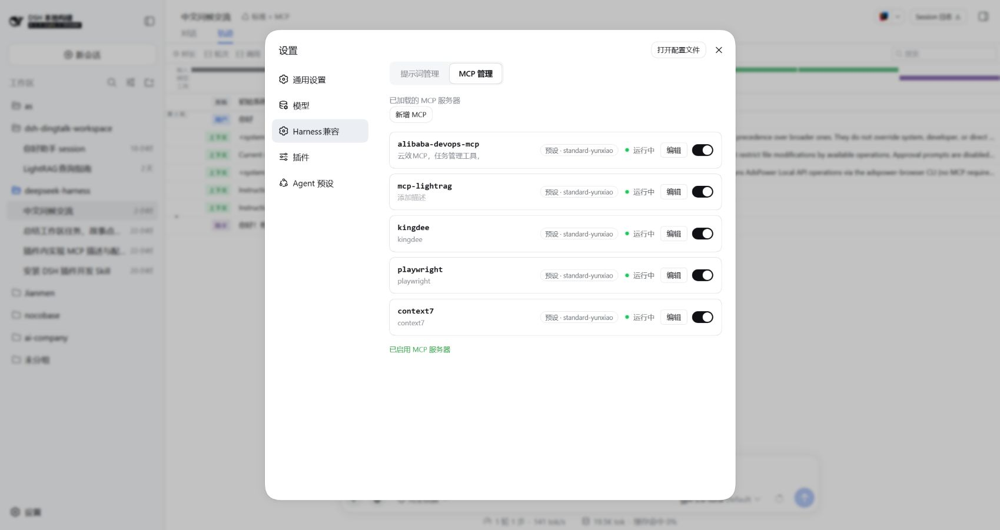
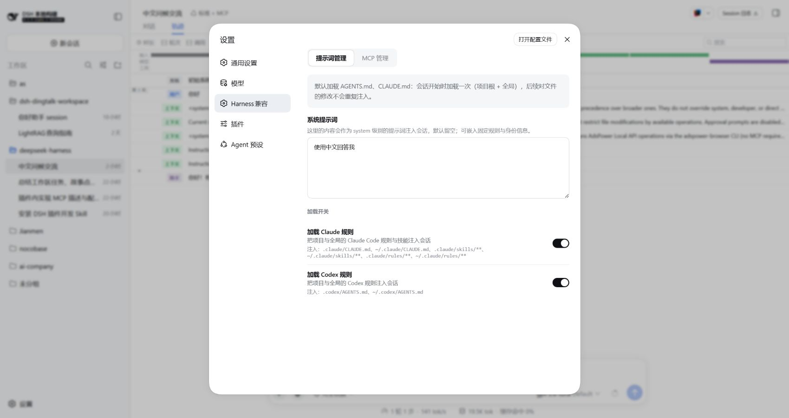
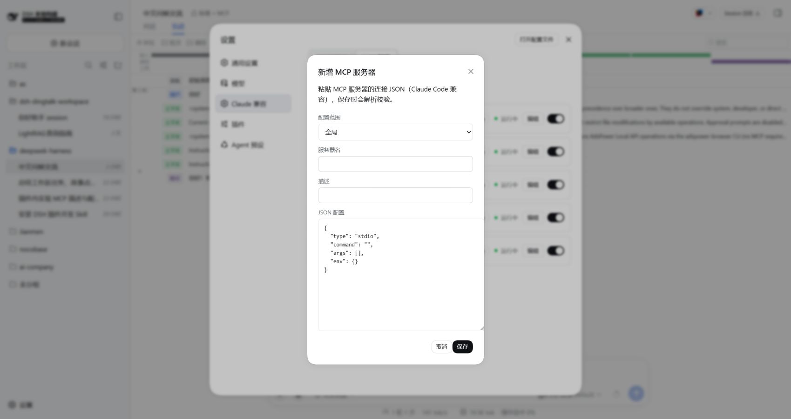

# dsh-claude-compat

[English](README.md) | 中文

一个**独立于 harness monorepo** 的 DeepSeek Harness (DSH) 插件:让 Harness 直接复用你现有的
Claude Code / Codex 配置,并在设置页加一个 **Harness 兼容** 面板 —— **在网页里管理 MCP 服务器
和提示词规则,不用再手改 YAML**。



## 有什么用

- **MCP 管理(实时)**:设置页列出所有 MCP 服务器(每个 `@deepseek-ai/dsh-mcp-client` 行)——
  全局的、以及每个 agent 预设里的,带作用域、描述、运行状态;每行可 **编辑 / 启用 / 禁用**,顶部可
  **新增**。写回组合文件后**立即对运行中的 host 生效,无需重启**。开关时那一行会短暂显示
  `启动中 / 停止中`,列表不会卡住。
- **Claude Code 兼容**:把 `<root>/.claude/skills/**` 纳入会话技能目录;把 `.claude/CLAUDE.md` 与
  `~/.claude/CLAUDE.md` 折叠进首次请求;折叠 `.claude/rules/**` —— 带 `paths:` 作用域的规则在你
  读到匹配文件时激活。
- **Codex 兼容**:折叠 `.codex/AGENTS.md` 与 `~/.codex/AGENTS.md`。
- **系统提示词**:在设置页写一段 system 级提示词,作为真实 system 提示词段注入。
- **两个总开关**:分别控制 Claude 规则 / Codex 规则的注入。
- **`/btw`**:在 fork 出的可继续子代理里问一个旁支问题。

## 截图

### 提示词管理 —— 系统提示词与规则开关



### MCP 管理 —— 一个 JSON 框,保存时解析并校验



## 安装

构建产物 `lib/` **已提交进仓库**,所以直接从 git 安装就能用,无需构建。

### 从 git 仓库安装(推荐)

```sh
# HTTPS(公开仓库)
npx @deepseek-ai/dsh plugin --profile web add "git+https://github.com/zhang-guo-wen/dsh-claude-compat.git#path:packages/claude-compat"

# 或 SSH
npx @deepseek-ai/dsh plugin --profile web add "git+ssh://git@github.com/zhang-guo-wen/dsh-claude-compat.git#path:packages/claude-compat"
```

`#path:packages/claude-compat` 指定仓库内的插件包(pnpm 的子目录 git 写法)。**再次执行同一条命令即为更新**;
在 path 之后追加 `#<commit 或 tag>` 可锁定版本。

### 从本地 checkout 安装

```sh
npx @deepseek-ai/dsh plugin --profile web add /绝对路径/dsh-claude-compat/packages/claude-compat
```

`file:` 依赖装的是**拷贝**,所以本地改完重建**不会**影响正在跑的 host,要重装才生效;
开发时想要实时联动请用 `pnpm link`(见 [AGENTS.md](AGENTS.md))。

### 在 profile 清单里声明

也可以直接作为 profile 依赖:

```json
{
  "dsh": { "profile": { "bundles": ["@zhang-guo-wen/dsh-claude-compat"] } },
  "dependencies": {
    "@zhang-guo-wen/dsh-claude-compat": "git+ssh://git@github.com/zhang-guo-wen/dsh-claude-compat.git#path:packages/claude-compat"
  }
}
```

装好后运行 `npx @deepseek-ai/dsh web`,打开设置页即可。

## 管理 MCP 服务器

打开 **设置 → Harness兼容 → MCP 管理**。harness 里配置过的每一台 MCP 都会列出,带作用域
(`全局` 或预设 id)、插件自带描述、以及实时状态。每行有 **编辑** 按钮和启用/禁用开关,
**新增 MCP** 打开编辑框。

这个列表是**每次调用都实时读 Cordis Loader**,所以改动一旦应用就会立刻反映:

- **全局** 行直接走 loader,实时生效。
- **预设(agent)** 行写预设的 `agent.cordis.yml`,再**就地刷新**该预设的 standing mount ——
  所以启用/禁用一台**不会**重启其它 MCP。

### 编辑框的 JSON

编辑框接受 Claude 兼容的连接 JSON 并归一化。以下写法都可以:

```json
{ "type": "stdio", "command": "cmd", "args": ["/c", "npx", "-y", "@upstash/context7-mcp"] }
```

```json
{ "context7": { "command": "cmd", "args": ["/c", "npx", "-y", "@upstash/context7-mcp"] } }
```

```json
{ "mcpServers": { "context7": { "command": "cmd", "args": ["/c", "npx", "-y", "@upstash/context7-mcp"] } } }
```

规则:

- 省略 `type` 会推断:有 `command` → stdio,有 `url` → streamable HTTP。
- 单键映射或 `mcpServers` 包装 → 用 key 当服务器名。
- 裸 spec → **服务器名** 字段留空时,从参数推断服务器名(`@upstash/context7-mcp` → `context7-mcp`)。
- stdio 需要 `command`;http / sse / streamable-http 需要 `url`。

**配置范围** 下拉列出「全局 + 所有 agent 预设」,选就行,不用手填 id。**描述** 是插件自带的标签
(存在 `context-injection` settings 命名空间里),**不属于** MCP 连接配置。

## Claude Code / Codex 兼容

### 技能

| 等级 | 来源 | 路径 |
|---|---|---|
| 250 | `project-claude` | `<projectRoot>/.claude/skills` |
| 550 | `user-claude` | `~/.claude/skills` |

项目根为最近的、含 `.git` 的祖先目录。技能为 `<root>/.claude/skills/<name>/SKILL.md`
(或平级 `<name>.md`),带 YAML frontmatter:必填 `name` 与 `description`,可选 `whenToUse`、
`metadata`、`disable-model-invocation`、`user-invocable`。

### 规则

项目 `.claude/CLAUDE.md` 与全局 `~/.claude/CLAUDE.md` 作为 `user` 消息(`claude-code` source kind)
折叠进首次请求。`.claude/rules/**`(项目)与 `~/.claude/rules/**`(用户)下的规则以 `claude-rule`
折叠:frontmatter 带 `paths:` glob 列表的规则是**路径作用域**的,在 `read` 到匹配文件后折叠;
不带 `paths` 的规则始终生效。

### 配置项

| 字段 | 默认 | 含义 |
|---|---|---|
| `providerName` | `claude-code` | 注册在 `ctx.skills` 上的唯一 provider 名 |
| `claudeHome` | `$CLAUDE_HOME` 或 `~/.claude` | Claude Code 目录;扫描 `skills` 与 `CLAUDE.md` |
| `codexHome` | `$CODEX_HOME` 或 `~/.codex` | Codex 目录;扫描 `AGENTS.md` |
| `projectRootMarkers` | `['.git']` | 识别项目根的目录条目 |
| `includeProjectRoot` | `true` | 扫描项目 `.claude/skills` 根 |
| `includeGlobalRoot` | `true` | 扫描用户 `~/.claude/skills` 根 |
| `includeProjectRule` | `true` | 加载项目 `.claude/CLAUDE.md` |
| `includeGlobalRule` | `true` | 加载全局 `~/.claude/CLAUDE.md` |
| `includeProjectRules` | `true` | 折叠项目 `.claude/rules/**` |
| `includeGlobalRules` | `true` | 折叠用户 `~/.claude/rules/**` |
| `maxRuleSourceBytes` | `1048576` | 单个规则文件最大 UTF-8 字节数 |
| `maxRuleRenderBytes` | `262144` | 单批规则渲染最大 UTF-8 字节数 |
| `claude` / `codex` | `true` | 规则注入总开关(设置页也可改) |
| `maxQuestionBytes` | `4096` | `/btw` 旁支问题的最大 UTF-8 字节数 |
| `provider` | `fork` | `/btw` 使用的 `ctx.subagents` fork provider 名 |

## 已知限制

- **暂无技能 watch** —— `.claude/skills` 在 `list()` 时发现;增删改会在下次发现时拾取。
- **规则每次会话只折叠一次** —— `.claude/CLAUDE.md`、`~/.claude/CLAUDE.md`、`.codex/AGENTS.md`
  在首次请求读取,之后编辑不会在会话中重读。
- **路径作用域规则只由 `read` 触发** —— `write` / `edit` 不激活。
- **启用 MCP 仍要等子进程自身启动**(`npx -y …` / `uvx …` 通常 1–3 秒)。UI 不卡;把 server 装成
  直接可执行文件能显著缩短。

## 开发

构建、Cordis/Typert 插件契约与坑见 [AGENTS.md](AGENTS.md)。

```sh
npm run build      # host (tsdown) + client (rolldown ModuleLoader handoff)
```

## License

MIT
